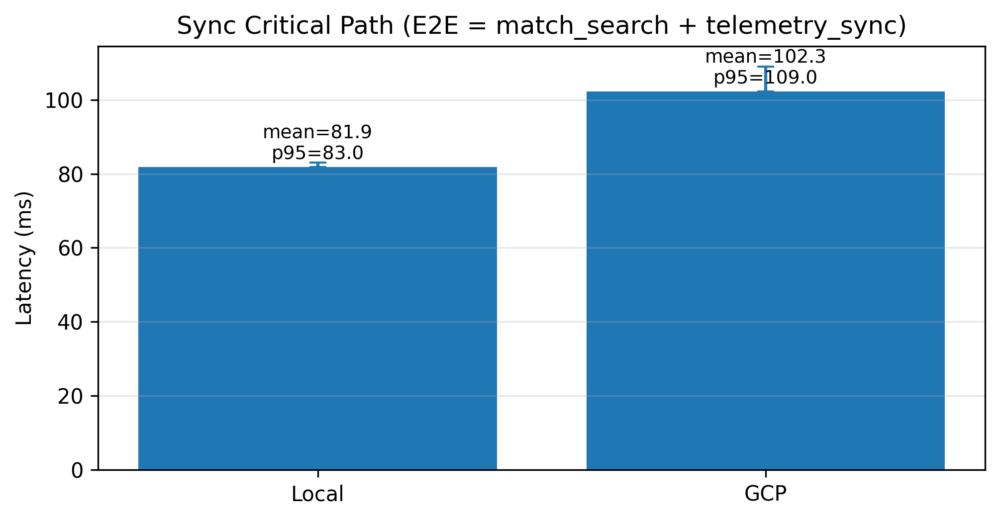

# CMPT756 Final Project

## Summary
Course: CMPT 756 (Distributed & Cloud Systems)  
Topic: Cloud Deployment Choices Impacting Performance of a Web Application Using Microservices Architecture

We compare deployment and coupling effects using:
- `nakama + postgres` as core server-side services
- `admin-api` as an independent server-side microservice
- `fishgame-godot` as a client workload generator (not a microservice)

## Architecture (At a Glance)
```text
fishgame-godot (client workload)
          |
          | gameplay/auth/match traffic
          v
       nakama  -----------------> postgres
          ^
          |
          | HTTP integration (checks + telemetry ingestion)
          |
       admin-api

dashboard-api (placeholder, separate server-side service)
```

Microservice boundary note:
- Server-side services: `nakama`, `postgres`, `admin-api`, `dashboard-api (placeholder)`
- Client only: `fishgame-godot`
- `admin-api` integrates with Nakama via HTTP and avoids shared DB coupling.
- Services can own their own DB when needed (e.g., admin/dashboard DB optional in future).

## Deployment Modes
### A) Single-machine compose (recommended dev)
Run `nakama/docker-compose.yml` to start:
- `postgres + nakama + admin-api`

### B) Split-VM mode
Each service runs with its own compose:
- `nakama/` on one VM
- `admin/` on another VM (set `NAKAMA_HOST`)
- `dashboard/` on another VM (placeholder; set upstream base URLs later)

## Quick Start
### Single-machine
```bash
cd nakama
docker compose up -d --build
curl http://localhost:8000/health
curl http://localhost:7351
```

### Standalone admin-api
```bash
cd admin
docker compose up -d --build
curl http://localhost:8000/health
curl http://localhost:8000/config
```

### Dashboard placeholder
```bash
cd dashboard
docker compose up -d --build
curl http://localhost:8100/health
curl http://localhost:8100/metrics
```

## Common Ports
- `7350`: Nakama API
- `7351`: Nakama Console
- `8000`: admin-api
- `8100`: dashboard-api placeholder
- `5432`: Postgres

## GCP VM Deployment Guide
This section is the practical split-VM deployment path we used on Google Compute Engine.
For full per-service commands, see:
- [`nakama/README.md`](nakama/README.md)
- [`admin/README.md`](admin/README.md)
- [`dashboard/README.md`](dashboard/README.md)

### 1) Create VMs (recommended profile)
Recommended instance profile (example used in project):
- Image: **Ubuntu minimal 22.04 (jammy)**
- Machine type: **e2-medium** (2 vCPU, 4 GB RAM)
- Zone: **us-west1-c**
- External IP: ephemeral is fine for course experiments
- Network tags: `nakama`, `adminapi`, `dashboardapi` (match firewall target tags exactly)

Console path:
1. Compute Engine -> VM instances -> Create instance.
2. Choose zone/machine/image above.
3. Add the correct network tag for each VM.
4. Create.

Optional `gcloud` examples:
```bash
gcloud compute instances create nakama-vm \
  --zone=us-west1-c \
  --machine-type=e2-medium \
  --image-family=ubuntu-minimal-2204-lts \
  --image-project=ubuntu-os-cloud \
  --tags=nakama

gcloud compute instances create admin-vm \
  --zone=us-west1-c \
  --machine-type=e2-medium \
  --image-family=ubuntu-minimal-2204-lts \
  --image-project=ubuntu-os-cloud \
  --tags=adminapi

gcloud compute instances create dashboard-vm \
  --zone=us-west1-c \
  --machine-type=e2-medium \
  --image-family=ubuntu-minimal-2204-lts \
  --image-project=ubuntu-os-cloud \
  --tags=dashboardapi
```

### 2) Firewall Rules (target tags + source ranges)
Create rules by **target tag**:
- `allow-nakama-ports`: tcp `7350,7351` (and `7349` if needed) -> target tag `nakama`
- `allow-admin-api-8000`: tcp `8000` -> target tag `adminapi`
- `allow-dashboard-api-8100`: tcp `8100` -> target tag `dashboardapi`

Source IPv4 choices:
- Demo/open: `0.0.0.0/0`
- Safer: your team public IP as `/32` (recommended when possible)

Optional `gcloud` examples:
```bash
# demo-open
gcloud compute firewall-rules create allow-nakama-ports \
  --allow=tcp:7350,tcp:7351,tcp:7349 \
  --target-tags=nakama \
  --source-ranges=0.0.0.0/0

gcloud compute firewall-rules create allow-admin-api-8000 \
  --allow=tcp:8000 \
  --target-tags=adminapi \
  --source-ranges=0.0.0.0/0

gcloud compute firewall-rules create allow-dashboard-api-8100 \
  --allow=tcp:8100 \
  --target-tags=dashboardapi \
  --source-ranges=0.0.0.0/0
```

### 3) Install Docker + Compose v2 (on each VM)
```bash
sudo apt-get update
sudo apt-get install -y ca-certificates curl gnupg lsb-release
sudo install -m 0755 -d /etc/apt/keyrings
curl -fsSL https://download.docker.com/linux/ubuntu/gpg | sudo gpg --dearmor -o /etc/apt/keyrings/docker.gpg
echo \
  "deb [arch=$(dpkg --print-architecture) signed-by=/etc/apt/keyrings/docker.gpg] https://download.docker.com/linux/ubuntu \
  $(. /etc/os-release && echo $VERSION_CODENAME) stable" | \
  sudo tee /etc/apt/sources.list.d/docker.list > /dev/null
sudo apt-get update
sudo apt-get install -y docker-ce docker-ce-cli containerd.io docker-buildx-plugin docker-compose-plugin
sudo usermod -aG docker "$USER"
newgrp docker
docker --version
docker compose version
```

### 4) Get External IP
From VM (metadata):
```bash
curl -H "Metadata-Flavor: Google" \
  "http://metadata.google.internal/computeMetadata/v1/instance/network-interfaces/0/access-configs/0/external-ip"
```
Or from GCP Console: Compute Engine -> VM instances -> External IP column.

### 5) Transfer Project to VM
From local machine:
```bash
tar --exclude='.git' --exclude='nakama/data' --exclude='**/__pycache__' -czf cmpt756-final-project.tgz cmpt756-final-project
scp -i ~/.ssh/<your_key> cmpt756-final-project.tgz <user>@<vm_external_ip>:~/
```

On VM:
```bash
cd ~
tar -xzf cmpt756-final-project.tgz
cd cmpt756-final-project
```

### 6) Run Split-VM Services
Nakama VM (run only Nakama + Postgres from the same compose):
```bash
cd ~/cmpt756-final-project/nakama
docker compose up -d --build postgres nakama
```

Admin VM (set remote Nakama host):
```bash
cd ~/cmpt756-final-project/admin
cp .env.example .env
# edit .env -> NAKAMA_HOST=<nakama_vm_external_ip_or_dns>
docker compose up -d --build
```

Dashboard VM (placeholder):
```bash
cd ~/cmpt756-final-project/dashboard
docker compose up -d --build
```

### 7) Verification Checklist
From each VM or from your local machine (if firewall allows):
```bash
# Nakama VM
curl http://<nakama_vm_external_ip>:7351

# Admin VM
curl http://<admin_vm_external_ip>:8000/health
curl http://<admin_vm_external_ip>:8000/nakama/api
curl http://<admin_vm_external_ip>:8000/nakama/console

# Dashboard VM
curl http://<dashboard_vm_external_ip>:8100/health
curl http://<dashboard_vm_external_ip>:8100/metrics
```

### 8) Troubleshooting
- Timeout/refused connection: check firewall rule source range + target tag match.
- Wrong tag on VM: firewall exists but not applied.
- Wrong host/port in `.env`: verify `NAKAMA_HOST`, `NAKAMA_API_PORT`, `NAKAMA_CONSOLE_PORT`.
- Docker/Compose missing: rerun install section and check `docker compose version`.
- UFW enabled: allow required ports (`sudo ufw status`).
- Service issues: `docker compose ps` and `docker compose logs -f`.

## Cloud VM Checklist (Split Mode)
- Deploy Nakama VM first; open `7350` and `7351`.
- Deploy Admin VM; set `NAKAMA_HOST`; open `8000`.
- Deploy Dashboard VM; set `ADMIN_API_BASE_URL` (placeholder); open `8100`.

## Service Docs
- Nakama stack: [`nakama/README.md`](nakama/README.md)
- Admin service: [`admin/README.md`](admin/README.md)
- Dashboard service: [`dashboard/README.md`](dashboard/README.md)
- Load testing (k6): [`loadtest/README.md`](loadtest/README.md)
- Fishgame latency/coupling: [`docs/fishgame-latency.md`](docs/fishgame-latency.md)
- Architecture notes: [`docs/architecture.md`](docs/architecture.md)

## Repo Layout
- `nakama/`: single-machine compose + runtime mount path
- `admin/`: standalone admin-api compose + code
- `dashboard/`: standalone dashboard placeholder compose + code
- `fishgame-godot/`: client workload + instrumentation
- `loadtest/`: k6 scripts and usage
- `docs/`: architecture, experiment logs, latency notes, figures

## Current Result (Figure)
Sync telemetry coupling result (E2E):



## Notes
- Console credentials: see `nakama/docker-compose.yml`.
- Local runtime path `nakama/data/` is gitignored.
- Detailed k6 usage is in `loadtest/README.md`.

## License
See [`THIRD_PARTY_NOTICES.md`](THIRD_PARTY_NOTICES.md).
